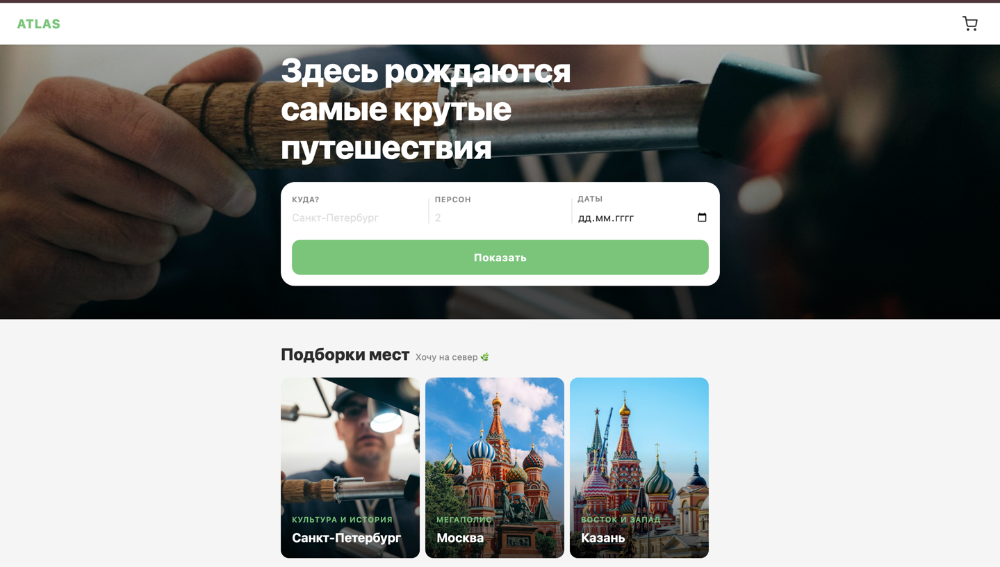

# ATLAS — Персональный планировщик путешествий

Веб-приложение для самостоятельного планирования городских поездок. Пользователь проходит короткий опрос, выбирает интересные места из персональной подборки и получает готовый маршрут по дням с расписанием и стоимостью.

---

## Скриншот стартовой страницы



---

## Технологии

| Технология | Версия | Роль в проекте |
|---|---|---|
| **Vue 3** | 3.x | UI-фреймворк, Composition API, компонентная архитектура |
| **TypeScript** | 5.x | Статическая типизация всего кода |
| **Vite** | 5.x | Сборщик, dev-сервер с HMR |
| **Vue Router 4** | 4.x | Клиентская навигация между страницами (SPA) |
| **Pinia** | 2.x | Глобальное состояние (корзина, планировщик, пользователь, избранное) |
| **MSW** (Mock Service Worker) | 2.x | Перехват HTTP-запросов и имитация REST API без бэкенда |
| **Vitest** + **@vue/test-utils** | 2.x | Юнит-тестирование компонентов, composables и store |
| **CSS Custom Properties** | — | Дизайн-система и тёмная тема через CSS-переменные |

---

## Запуск проекта

**Требования:** Node.js 18+

```bash
# Установка зависимостей
npm install

# Запуск dev-сервера (http://localhost:5173)
npm run dev
```

```bash
# Запуск тестов
npm run test

# Сборка продакшн-версии
npm run build
```

> Все данные — демонстрационные моки. Реальных API, баз данных и внешних сервисов нет.
